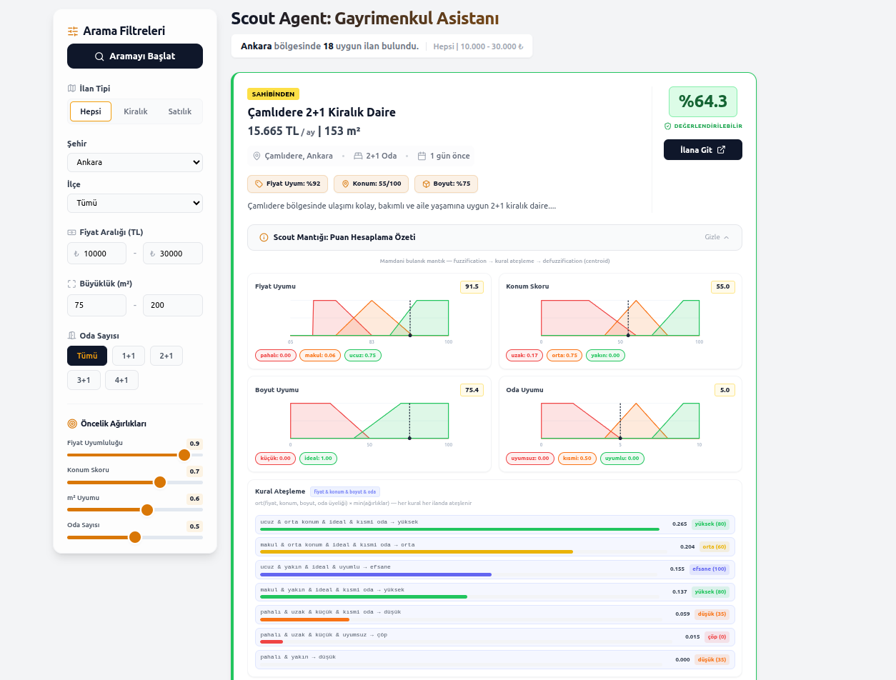

## Scout Agent: Intelligent Real Estate Assistant

Scout Agent is an AI-powered real estate assistant that moves beyond rigid filtering systems. By combining fuzzy logic with an optional LLM scoring step, it evaluates property listings and returns a personalized "Suitability Score".

### Features

- Fuzzy Evaluation: Handles flexible criteria (e.g., "slightly expensive but great location") instead of strict binary filters.

- Multi-Criteria Scoring: Balances price suitability, location score, size suitability, and room match.

- Optional LLM Scoring: Uses Groq (Llama 3) to enrich listings with a cached `llm_score` during dataset normalization.

### Fuzzy Inputs

- price_suitability (0-100): Higher is cheaper relative to the selected price range.
- location_score (0-100): Higher is closer to the target district or central areas.
- size_suitability (0-100): Higher is closer to the selected m2 range center.
- room_match (0-10): 10 for exact match when rooms are filtered, 0 otherwise.

### Project Structure

```
.
├── backend/
│   ├── main.py               # FastAPI entry point
│   ├── requirements.txt      # Backend Python dependencies
│   ├── routers/              # API endpoints (listings, etc.)
│   │   ├── __init__.py
│   │   └── listings.py
│   ├── scratch/              # Data fix/utility scripts
│   │   ├── check_missing_data.py
│   │   ├── enrich_dataset.py
│   │   ├── ensure_district_coverage.py
│   │   ├── fill_missing_data.py
│   │   ├── fix_prices.py
│   │   ├── fix_urls.py
│   │   └── test_filters.py
│   ├── services/             # Service layer (empty/init)
│   │   └── __init__.py
│   └── src/
│       ├── __init__.py
│       ├── data/             # Data loaders and processors
│       │   ├── __init__.py
│       │   ├── loader.py
│       │   ├── processor.py
│       │   └── scraper.py
│       ├── fuzzy/            # Fuzzy logic engine
│       │   ├── __init__.py
│       │   └── engine.py
│       ├── llm/              # LLM client and logic
│       │   ├── __init__.py
│       │   └── groq_client.py
│       └── utils/            # Utilities (notifier, etc.)
│           ├── __init__.py
│           └── notifier.py
├── frontend/
│   ├── app/                  # Next.js app router (layout, page)
│   │   ├── globals.css
│   │   ├── layout.tsx
│   │   └── page.tsx
│   ├── components/           # React components
│   │   ├── FilterSidebar.tsx
│   │   ├── FuzzyVizPanel.tsx
│   │   └── ListingCard.tsx
│   ├── lib/                  # API helpers
│   │   └── api.ts
│   ├── types/                # TypeScript types
│   │   └── listing.ts
│   ├── public/               # Static assets
│   ├── package.json
│   ├── next.config.js
│   └── ... (config, env, etc.)
├── data/                     # Local synthetic JSON datasets
│   ├── ads.json
│   ├── dataset.json
│   └── normalized_ads.json
├── reports/                  # LLM and other reports
│   └── llm.txt
├── tests/                    # Python tests
│   └── __init__.py
├── requirements.txt          # Top-level requirements (if any)
├── 3fuzzykurallar.txt        # Fuzzy rules (text)
└── README.md
```

### Installation

1. Clone repo
```bash
git clone https://github.com/oznurkarahasan/scout-agent.git
cd scout-agent
```

2. Setup Python env
```bash
python -m venv venv
source venv/bin/activate  # Windows: venv\Scripts\activate
```

3. Configure environment variables (optional)
```bash
cp .env.example .env
# .env içine GROQ_API_KEY=your_groq_api_key_here
```

### Running

**Backend** (FastAPI — port 8000)
```bash
source venv/bin/activate        # Windows: venv\Scripts\activate
cd backend
pip install -r requirements.txt   # first run
uvicorn main:app --reload --port 8000
```

**Frontend** (Next.js — port 3000)
```bash
cd frontend
npm install   # first run
npm run dev
```

### Screenshots

